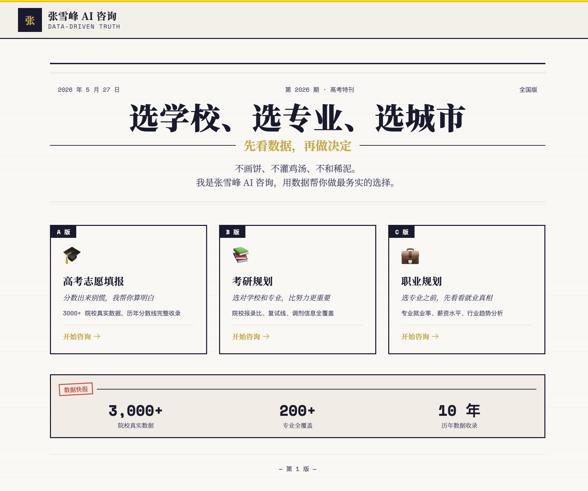
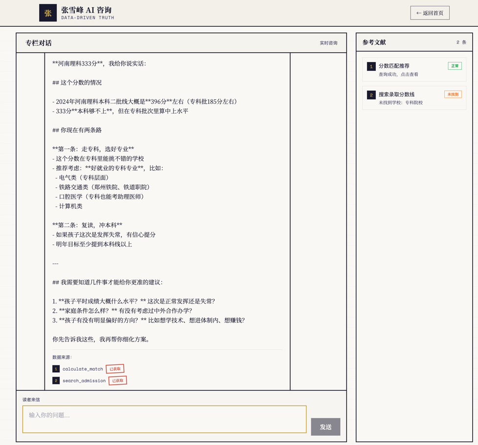

# 张雪峰 AI 咨询 Agent

> 张雪峰的认知操作系统，可运行的高考/考研/职业规划顾问

## 功能

- 🎯 **高考志愿咨询**：根据分数/省份/家庭背景，给出选校选专业建议
- 📚 **考研规划**：择校、择专业、备考策略
- 💼 **职业规划**：应届生就业方向、行业选择
- 🔍 **AI 驱动**：基于张雪峰心智模型 + 实时数据查询
- 💬 **灵魂追问**：多轮对话收集用户画像，提供精准建议

## 界面预览





## 快速开始

### 本地开发

```bash
# 1. 克隆项目
git clone <repo-url>
cd zhangxuefeng-agent

# 2. 创建虚拟环境
python -m venv .venv
source .venv/bin/activate  # Windows: .venv\Scripts\activate

# 3. 安装依赖
pip install -e ".[dev]"

# 4. 配置环境变量
cp .env.example .env
# 编辑 .env，填入 OPENAI_API_KEY

# 5. 启动后端
uvicorn app.main:app --reload --port 8000

# 6. 启动前端（新终端）
cd frontend && npm install && npm run dev
```

### Docker Compose

```bash
# 1. 配置环境变量
cp .env.example .env
# 编辑 .env，填入 OPENAI_API_KEY

# 2. 启动所有服务
docker compose up -d

# 3. 访问
# 前端: http://localhost:3000
# API: http://localhost:8000
# 文档: http://localhost:8000/docs
# 健康检查: http://localhost:8000/health
```

### Fly.io 部署

```bash
# 1. 安装 Fly CLI
curl -L https://fly.io/install.sh | sh

# 2. 登录
fly auth login

# 3. 创建应用（首次）
fly launch --no-deploy

# 4. 设置密钥
fly secrets set OPENAI_API_KEY=sk-xxx
fly secrets set REDIS_URL="rediss://default:<password>@<host>:<port>"

# 5. 部署
fly deploy

# 6. 查看状态
fly status
fly logs
```

**Upstash Redis 配置**：
1. 在 [Upstash Console](https://console.upstash.com) 创建 Redis 数据库
2. 选择区域 `Hong Kong (ap-east)` 与 Fly.io 同区域
3. 复制 `REDIS_URL`（带 `rediss://` 前缀）
4. 通过 `fly secrets set REDIS_URL=...` 注入

## 项目结构

```
zhangxuefeng-agent/
├── app/                        # 后端 FastAPI 应用
│   ├── main.py                 # 应用入口
│   ├── api/                    # API 路由层
│   │   ├── chat.py             # 对话接口（SSE 流式）
│   │   ├── health.py           # 健康检查
│   │   └── feedback.py         # 反馈接口
│   ├── core/                   # 配置、中间件、监控
│   │   ├── config.py           # pydantic-settings 配置
│   │   ├── middleware.py       # CORS、日志、异常处理
│   │   ├── metrics.py          # LLM 用量追踪
│   │   └── monitoring.py       # 日志 + Sentry
│   ├── models/                 # Pydantic 数据模型
│   │   ├── schemas.py
│   │   └── user_profile.py     # 用户画像模型
│   ├── services/               # 业务逻辑层
│   │   ├── llm.py              # LLM 调用封装（httpx）
│   │   ├── session.py          # Redis 会话管理
│   │   ├── skill.py            # SKILL.md 加载
│   │   ├── soul_query.py       # 灵魂追问引擎
│   │   ├── streaming.py        # SSE 流式响应
│   │   └── context.py          # 实体抽取 + 上下文管理
│   └── agent/                  # Agent 核心
│       ├── tools.py            # Function Calling 工具定义
│       ├── prompt_templates.py # Prompt 模板
│       └── ab_testing.py       # A/B 测试
├── backend/                    # 旧版后端（含 SQLAlchemy ORM + 种子数据）
├── frontend/                   # React + Vite + Tailwind CSS 前端
├── alembic/                    # 数据库迁移脚本
├── tests/                      # 测试套件
├── docs/                       # 文档
├── data/                       # SQLite 数据库
├── SKILL.md                    # 张雪峰 AI 技能定义（系统 Prompt）
├── pyproject.toml              # Python 依赖管理
├── Dockerfile
├── docker-compose.yml
├── .env.example
└── .gitignore
```

## API 接口

| 方法 | 路径 | 说明 |
|------|------|------|
| GET | `/health` | 健康检查 |
| POST | `/api/v1/chat` | 对话接口（SSE 流式） |
| POST | `/api/v1/feedback` | 用户反馈 |
| GET | `/api/v1/session/{id}` | 获取会话信息 |
| DELETE | `/api/v1/session/{id}` | 删除会话 |

## 技术栈

| 层 | 技术 |
|---|---|
| 后端框架 | FastAPI + Uvicorn |
| 前端框架 | React 18 + TypeScript + Vite 6 |
| 样式 | Tailwind CSS 3.4（报纸风主题） |
| LLM | OpenAI GPT-4o-mini / GPT-4o（支持代理） |
| 工具框架 | OpenAI Function Calling（原生） |
| 会话存储 | Redis |
| 数据库 | SQLite + SQLAlchemy + Alembic |
| 测试 | pytest（后端）+ Vitest（前端） |
| 监控 | Sentry + 自定义 MetricsCollector |

## 开发命令

```bash
# 后端
pip install -e ".[dev]"         # 安装依赖
uvicorn app.main:app --reload   # 启动开发服务器
pytest tests/                   # 运行测试
ruff check app/ backend/        # Lint
ruff format app/ backend/       # 格式化

# 前端
cd frontend
npm run dev                     # 启动开发服务器
npm run build                   # 构建
npm run test                    # 运行测试
npm run lint                    # Lint

# 数据库迁移
alembic upgrade head            # 执行迁移
alembic revision --autogenerate -m "desc"  # 生成迁移
```
## License

MIT
