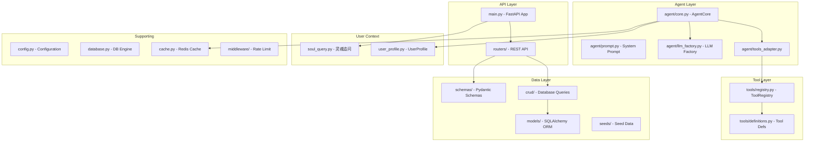
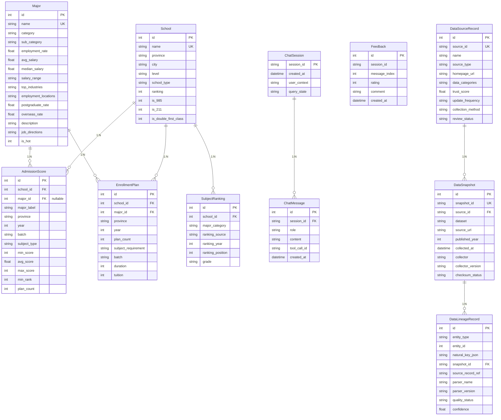
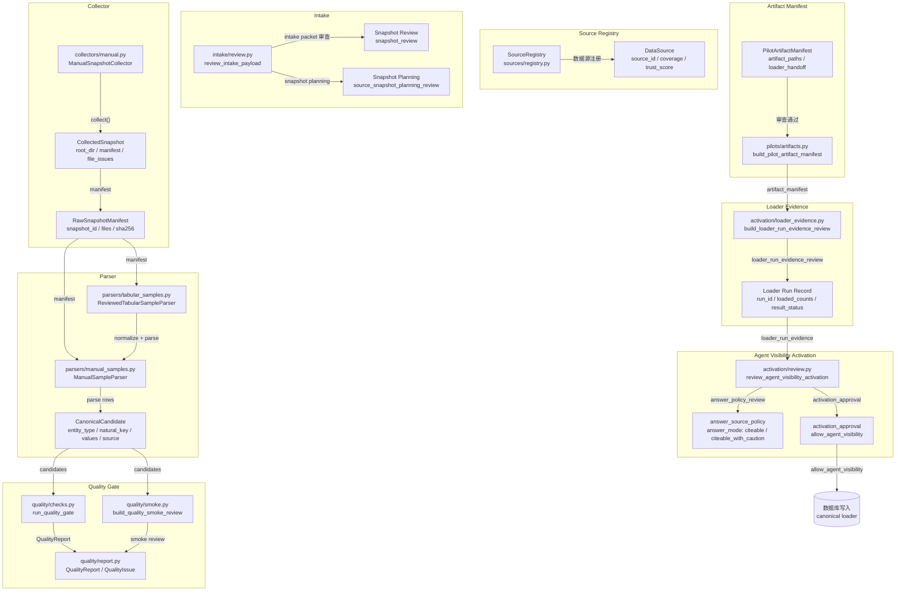
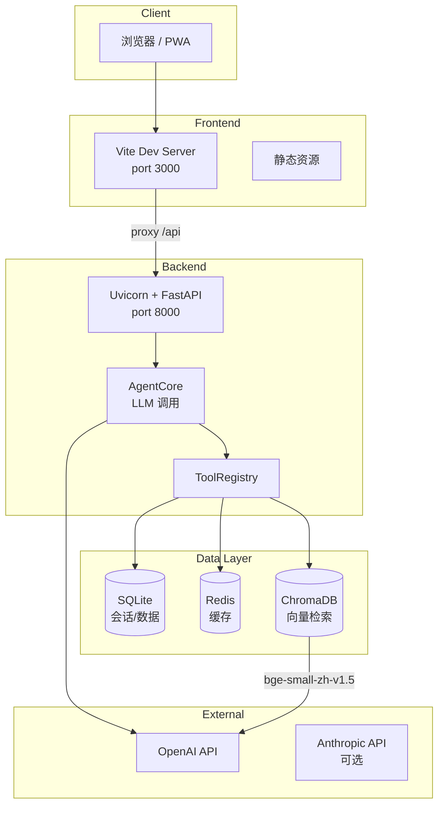

# 项目框架文档

> 生成时间：2026-06-28
> 项目：zhangxuefeng-agent（张雪峰 AI 咨询助手）

---

## 1. 后端目录结构

```
backend/
├── main.py                    # FastAPI 应用入口，路由注册
├── config.py                  # 全局配置（数据库、Redis、API 密钥）
├── database.py                # SQLAlchemy 引擎 + Session 工厂
├── dependencies.py            # FastAPI 依赖注入（get_db, get_redis）
├── user_profile.py            # UserProfile 模型 + Redis 持久化
├── soul_query.py              # 灵魂追问引擎（用户画像补全）
├── session_store.py           # 会话消息存储
├── cache.py                   # Redis 缓存封装
├── security.py                # 安全工具（敏感信息脱敏）
├── logging_config.py          # 日志配置
├── time_utils.py              # 时间工具函数
├── docs.py                    # API 文档生成
├── export.py                  # 数据导出功能

├── agent/                     # AI Agent 核心模块
│   ├── __init__.py
│   ├── core.py                # OpenAI API 调用 + Function Calling 调度
│   ├── prompt.py              # 系统提示词（内置备选）
│   ├── llm_factory.py         # LLM 工厂（支持多模型切换）
│   ├── structured_output.py   # 结构化输出解析
│   ├── tools_adapter.py       # 工具适配器（适配 registry）
│   ├── langchain_agent.py     # LangChain 集成（实验性）
│   ├── langsmith_config.py     # LangSmith 追踪配置
│   └── source_policy.py       # 答案来源策略审查

├── tools/                     # 工具系统
│   ├── __init__.py
│   ├── definitions.py         # 工具定义（5 个核心工具）
│   └── registry.py            # 装饰器式工具注册表

├── routers/                   # API 路由
│   ├── __init__.py            # 路由汇总导出
│   ├── schools.py             # 学校查询路由
│   ├── majors.py              # 专业查询路由
│   ├── scores.py              # 录取分数线路由
│   ├── plans.py               # 招生计划的路由
│   └── subject_rankings.py    # 学科排名路由

├── models/                    # SQLAlchemy ORM 模型
│   ├── __init__.py
│   ├── school.py              # School 院校表
│   ├── major.py               # Major 专业表
│   ├── admission_score.py     # AdmissionScore 录取分数表
│   ├── enrollment_plan.py     # EnrollmentPlan 招生计划表
│   ├── subject_ranking.py     # SubjectRanking 学科排名表
│   ├── chat.py                # ChatSession / ChatMessage 会话表
│   ├── feedback.py            # Feedback 用户反馈表
│   └── data_lineage.py        # 数据血缘追踪表

├── schemas/                    # Pydantic 请求/响应模型
│   ├── __init__.py
│   ├── school.py              # SchoolOut / SchoolQuery
│   ├── major.py               # MajorOut / MajorQuery
│   ├── admission_score.py      # AdmissionScoreOut / ScoreStats
│   └── enrollment_plan.py      # EnrollmentPlanOut / EnrollmentPlanQuery

├── crud/                       # 数据库查询封装
│   ├── __init__.py
│   ├── school.py               # get_school / get_schools / 按省份/层级查询
│   ├── major.py                # get_major / get_majors / 热门专业/就业查询
│   ├── admission_score.py      # 按学校/专业查询分数 / 分数统计
│   ├── enrollment_plan.py       # 按学校/专业查询计划
│   └── subject_ranking.py      # 学科排名查询

├── seeds/                      # 种子数据导入脚本
│   ├── __init__.py
│   ├── import_cli.py           # CLI 导入入口
│   ├── import_data.py          # 基础数据导入
│   ├── import_extended.py      # 扩展数据导入
│   ├── import_full_data.py     # 全量数据导入
│   ├── import_zhejiang.py      # 浙江数据专项导入
│   ├── generate_*.py           # 数据生成脚本
│   ├── embed_data.py           # Embedding 向量化
│   ├── data_quality.py        # 数据质量检查
│   └── seed_*.json            # JSON 种子数据文件

├── data_pipeline/              # 数据摄入管道（审计用）
│   ├── __init__.py            # 管道合约（DataSource / SourceRegistry / RawSnapshotManifest）
│   ├── env_check.py           # 环境检查
│   └── sources/               # 数据源注册
│       ├── registry.py        # DataSource / SourceRegistry 类

├── real_data/                  # 真实数据处理模块
│   ├── __init__.py
│   ├── cli.py                 # CLI 入口
│   ├── contracts.py           # 数据契约定义
│   ├── parser.py              # 原始数据解析器
│   ├── adapter.py             # 数据适配器
│   ├── approval.py            # 数据审批流
│   ├── bundle.py              # 数据打包
│   ├── manifest.py            # 清单管理
│   ├── pilot.py               # 试点运行器
│   ├── source_registry.py     # 数据源注册
│   └── staging.py            # 临时暂存

└── middleware/                # 中间件
    ├── __init__.py
    └── rate_limit.py          # 限流中间件
```

---

## 2. 核心模块职责说明

### 2.1 agent/ — AI Agent 引擎

| 文件 | 职责 |
|------|------|
| `core.py` | OpenAI Chat Completions API 调用、tool_calls 处理、多轮工具循环（最多 5 轮）、消息裁剪（保留最近 20 轮）、SSE 流式输出 |
| `prompt.py` | 内置系统提示词，当 SKILL.md 不存在时的备选 |
| `llm_factory.py` | LLM 实例工厂，支持多模型切换 |
| `structured_output.py` | 结构化输出解析（用于非 tool 调用的 JSON 响应） |
| `tools_adapter.py` | 将 `tools/registry.py` 的工具适配为 Agent 可用格式 |
| `langchain_agent.py` | LangChain 集成实验性代码 |
| `langsmith_config.py` | LangSmith 追踪配置 |
| `source_policy.py` | 答案来源策略审查，确保回答有据可查 |

### 2.2 tools/ — 工具系统

| 文件 | 职责 |
|------|------|
| `definitions.py` | 定义 7 个核心工具（search_admission / search_enrollment_plan / search_employment / compare_schools / search_policy / calculate_match / semantic_search） |
| `registry.py` | 装饰器 `@register_tool` 注册工具，带 TTL 缓存（5 分钟），支持同步/异步执行 |

#### 工具清单（共 7 个）

| 工具名 | 功能 | 必填参数 | 可选参数 |
|--------|------|----------|----------|
| `search_admission` | 搜索高校录取分数线 | `school_name` | `province`, `year`, `category` |
| `search_enrollment_plan` | 搜索高校招生计划 | `school_name` | `major_name`, `province`, `year` |
| `search_employment` | 搜索专业就业数据 | `major_name` | `degree_level` |
| `compare_schools` | 对比多所院校综合实力 | `school_names`（数组） | `dimensions` |
| `search_policy` | 搜索招生政策 | `keyword` | `school_name`, `year` |
| `calculate_match` | 根据分数推荐匹配院校 | `score`, `province`, `category` | `strategy`, `limit` |
| `semantic_search` | 语义搜索学校和专业 | `query`, `type` | `province`, `category`, `top_k` |

#### 注册机制

工具使用装饰器模式注册：

```python
from .registry import register_tool

@register_tool(
    name="search_admission",
    description="搜索高校录取分数线...",
    parameters={...}  # JSON Schema 格式
)
async def search_admission(...) -> str:
    ...
```

- `ToolRegistry` 类管理所有工具，存储 `ToolDef`（名称/描述/参数/函数）
- `get_all_definitions()` 返回 OpenAI Function Calling 格式的工具定义列表
- `dispatch()` 执行工具并返回字符串结果（供 Agent tool message 使用）
- 缓存机制：TTL 5 分钟，避免重复查询

#### 调用流程

```
AgentCore 收到 LLM tool_calls
    │
    ▼
tools_adapter 调用 tool_registry.dispatch_raw(name, arguments)
    │
    ├── 检查缓存（TTL 5 分钟）
    │
    ▼
执行 tool.fn(**arguments)
    │
    ├── 查询数据库（crud 层）
    │
    ├── 附加数据血缘（sources）
    │
    ▼
返回 JSON 字符串 → Agent → SSE 前端
```

#### 数据血缘追踪

工具结果自动附加来源信息：

- `_attach_sources_to_items()`：为每个结果项附加 `sources` 和 `source_summary`
- `_summarize_result_sources()`：汇总整个工具响应的来源状态
- `build_answer_source_policy()`：根据来源完整性决定答案引用策略

### 2.3 routers/ — REST API 路由

| 路由 | 前缀 | 职责 |
|------|------|------|
| `schools_router` | `/api/schools` | 院校查询（列表/详情/按省份/按层级） |
| `majors_router` | `/api/majors` | 专业查询（列表/详情/热门/就业方向） |
| `scores_router` | `/api/scores` | 录取分数查询（按学校/专业/省份） |
| `plans_router` | `/api/plans` | 招生计划查询 |
| `subject_rankings_router` | `/api/subject_rankings` | 学科排名查询 |

### 2.4 models/ — ORM 数据模型

| 模型 | 说明 |
|------|------|
| `School` | 院校基本信息（名称、省份、层级、类型等） |
| `Major` | 专业信息（名称、学科门类、就业方向、是否热门） |
| `AdmissionScore` | 录取分数（院校+专业+年份+省份+科类+最低分/省控线/位次） |
| `EnrollmentPlan` | 招生计划（院校+专业+年份+省份+计划数） |
| `SubjectRanking` | 学科排名（教育部学科评估结果） |
| `ChatSession` | 会话记录 |
| `ChatMessage` | 消息记录（用户/助手/工具调用） |
| `Feedback` | 用户反馈 |
| `DataLineageRecord / DataSnapshot / DataSourceRecord` | 数据血缘追踪 |

### 2.5 schemas/ — Pydantic 数据模式

定义 API 请求/响应的数据结构，如 `SchoolOut`、`MajorQuery`、`ScoreStats` 等。

### 2.6 crud/ — 数据库查询封装

封装 `get_schools`、`get_majors`、`get_admission_scores` 等查询函数，供 routers 和 tools 调用。

### 2.7 seeds/ — 种子数据管理

包含多个 JSON 种子文件（schools、majors、scores、plans、rankings）及导入脚本，支持分批次导入和扩展数据导入。

### 2.8 data_pipeline/ — 数据摄入管道（审计用）

采用合约式设计，暴露 `DataSource`、`SourceRegistry`、`RawSnapshotManifest` 抽象，通过懒加载避免强制依赖。

### 2.9 real_data/ — 真实数据处理

处理真实省级招生数据，包括解析、适配、审批、打包、清单管理和试点运行。

### 2.10 middleware/ — 中间件

限流中间件，保护 API 免受滥用。

---

## 3. 后端模块关系图



---

## 4. 核心数据流

```
用户消息
    │
    ▼
main.py → POST /chat
    │
    ▼
soul_query.py → 检查用户画像完整性
    │（若不完整 → 触发"灵魂追问"）
    │
    ▼
AgentCore (agent/core.py)
    │
    ├── 调用 OpenAI Chat Completions API
    │
    ├── 若返回 tool_calls：
    │       │
    │       ▼
    │   tools_adapter → tool_registry.dispatch_raw()
    │       │
    │       ▼
    │   tools/definitions.py → 执行具体工具
    │       │
    │       ▼
    │   crud/ → 数据库查询
    │       │
    │       ▼
    │   返回工具结果 → 再次调用 LLM
    │
    └── SSE 流式响应 → 前端
```

---

## 5. 工具系统设计

### 5.1 工具列表（共 7 个）

| 工具名 | 用途 | 主要数据来源 |
|--------|------|-------------|
| `search_admission` | 查询院校/专业录取分数 | `AdmissionScore` 表 |
| `search_enrollment_plan` | 查询高校招生计划 | `EnrollmentPlan` 表 |
| `search_employment` | 查询专业就业方向 | `Major` 表（就业率/薪资） |
| `compare_schools` | 对比院校层次/排名 | `School` 表（985/211/排名） |
| `search_policy` | 查询招生政策 | 预置政策库（强基/提前批等） |
| `calculate_match` | 计算分数与院校/专业匹配度 | `AdmissionScore` 表 |
| `semantic_search` | 语义搜索学校和专业 | 向量数据库（embedding） |

### 5.2 调用方式

工具通过 OpenAI Function Calling 协议调用，Agent 决定何时调用哪个工具：

1. **注册阶段**：每个工具函数使用 `@register_tool` 装饰器注册到 `ToolRegistry`
2. **Agent 调用**：AgentCore 将 `TOOLS`（所有工具定义）传给 LLM，LLM 返回 `tool_calls`
3. **调度阶段**：`tools_adapter` 调用 `tool_registry.dispatch_raw(name, args)`
4. **执行阶段**：工具函数查询数据库、附加来源信息、返回 JSON 结果
5. **结果回传**：工具结果作为 `tool` 类型的消息发回 LLM，生成最终回答

### 5.3 注册机制说明

- **装饰器模式**：`@register_tool(name, description, parameters)` 自动注册
- **参数 Schema**：使用 JSON Schema 定义参数类型和描述（OpenAI Function Calling 标准）
- **缓存机制**：`dispatch_raw()` 内置 TTL 5 分钟缓存，减少重复查询
- **异步支持**：工具函数支持 `async def`，自动检测并 await 执行
- **错误处理**：工具执行异常返回结构化错误 JSON，不会中断 Agent 循环

### 5.4 数据血缘追踪

所有工具结果自动附加来源元数据：

- `sources`：关联的数据血缘记录列表
- `source_summary`：来源统计（item_count / source_count / citation_ready / needs_caution）
- `answer_source_policy`：基于来源完整性生成的答案引用策略

---

## 6. 配置文件关键项

| 配置项 | 来源 | 说明 |
|--------|------|------|
| `DATABASE_URL` | `config.py` | PostgreSQL 连接串 |
| `REDIS_URL` | `config.py` | Redis 连接串 |
| `OPENAI_API_KEY` | `config.py` | OpenAI API 密钥 |
| `SKILL.md` 路径 | `config.py` | Agent Persona 定义文件路径 |

---

## 7. 数据模型关系

### 7.1 ER 图（Mermaid 格式）



### 7.2 模型关系表

| 实体 | 主键 | 关联关系 | 说明 |
|------|------|----------|------|
| `School` | `id` | — | 院校基础信息，一方 |
| `Major` | `id` | — | 专业基础信息，一方 |
| `AdmissionScore` | `id` | `school_id` → School（多对一）<br>`major_id` → Major（多对一，可空） | 录取分数线，`major_id` 可空表示未匹配标准专业，此时用 `major_label` 存储原始投档单位名称 |
| `EnrollmentPlan` | `id` | `school_id` → School（多对一）<br>`major_id` → Major（多对一） | 招生计划，`school_id + major_id + province + year` 唯一 |
| `SubjectRanking` | `id` | `school_id` → School（多对一） | 学科排名，`school_id + major_category + ranking_source + ranking_year` 唯一 |
| `ChatSession` | `session_id` | — | 会话，`user_context` 和 `query_state` 为 JSON 字符串 |
| `ChatMessage` | `id` | `session_id` → ChatSession（多对一） | 消息记录，`role` 取值：user / assistant / tool |
| `Feedback` | `id` | — | 用户反馈，`session_id` 加索引，无外键约束 |
| `DataSourceRecord` | `id` | — | 注册数据源，`source_id` 唯一 |
| `DataSnapshot` | `id` | `source_id` → DataSourceRecord（多对一） | 原始快照，`snapshot_id` 唯一 |
| `DataLineageRecord` | `id` | `snapshot_id` → DataSnapshot（多对一） | 数据血缘，关联canonical行与原始快照 |

### 7.3 核心业务四元组约束

`AdmissionScore` 记录的核心四元组：

```
(school_id, major_id/major_label, province, year, batch, subject_type)
```

唯一约束 `uq_admission_score` 确保同一院校、同一投档单位、同一省份、同一年的同一批次、同一科类只有一条录取分数记录。

`major_id` 与 `major_label` 的设计说明：
- `major_id`：关联到 `Major` 表的标准专业 ID（可空）
- `major_label`：原始投档单位标签（包含方向/班级等差异信息），当 `major_id` 为空时使用
- 两者可同时存在，此时表示该投档单位已匹配到标准专业

### 7.4 Schema 与 ORM 模型对照

| Schema | 对应 ORM 模型 | 主要字段 |
|--------|--------------|----------|
| `SchoolOut` | `School` | 院校基本信息 |
| `SchoolQuery` | — | 查询参数（支持省份/层级/类型/985/211过滤，分页） |
| `MajorOut` | `Major` | 专业信息（就业率/薪资/方向） |
| `MajorQuery` | — | 查询参数（支持门类/就业率/薪资过滤，分页） |
| `AdmissionScoreOut` | `AdmissionScore` | 分数 + 关联字段 `school_name` / `major_name` |
| `AdmissionScoreQuery` | — | 查询参数（支持院校名/专业名/省份/年份范围/分数区间，分页） |
| `ScoreStats` | — | 聚合统计（min_score / avg_score / max_score / min_rank） |
| `EnrollmentPlanOut` | `EnrollmentPlan` | 计划 + 关联字段 `school_name` / `major_name` |
| `EnrollmentPlanQuery` | — | 查询参数（支持院校名/专业名/省份/年份，分页） |

Schema 层为 Pydantic 模型，继承 `BaseModel`，通过 `model_config = {"from_attributes": True}` 支持从 ORM 模型直接序列化。`AdmissionScoreOut` 和 `EnrollmentPlanOut` 额外包含 JOIN 查询时填充的关联字段 `school_name` 和 `major_name`，不属于 ORM 模型列。

---

## 8. 数据 Pipeline 流程

### 8.1 模块概述

`data_pipeline/` 是一个**无写入审计用**数据摄入管道，采用合约式设计，暴露 `DataSource`、`SourceRegistry`、`RawSnapshotManifest` 抽象，通过懒加载避免强制依赖。设计原则：

- **无写入**：所有审查模块（smoke / review）均为只读，不写入数据库或种子数据
- **多阶段门控**：数据从来源到 Agent 可见需经过多个审查关卡
- **可追溯**：每条候选数据携带完整来源元信息（快照 ID、置信度、审查人）

### 8.2 目录结构

```
backend/data_pipeline/
├── __init__.py               # 懒加载导出 DataSource / SourceRegistry / RawSnapshotManifest
├── env_check.py             # 环境依赖检查（Python >= 3.11 / pydantic / sqlalchemy）
│
├── sources/                   # 数据源注册
│   └── registry.py           # DataSource / SourceRegistry / SourceRegistryAudit
│
├── collectors/                # 原始快照采集器
│   ├── base.py               # SnapshotCollector 协议 / CollectedSnapshot 数据类
│   └── manual.py             # ManualSnapshotCollector（读取本地已审查快照目录）
│
├── raw_store/                 # 原始快照存储
│   ├── manifest.py           # RawSnapshotManifest / ManifestFile 模型
│   ├── checksums.py          # SHA256 校验
│   └── __init__.py
│
├── intake/                    # 官方样本摄入审查
│   ├── review.py             # review_intake_payload() — intake packet 审查
│   └── cli.py
│
├── parsers/                   # 解析器（raw rows → canonical candidates）
│   ├── base.py               # CandidateParser 协议
│   ├── manual_samples.py     # ManualSampleParser（人工规范化行解析）
│   ├── tabular_samples.py    # ReviewedTabularSampleParser（CSV 表格行解析 + 规范化）
│   ├── rows_bundle_smoke.py  # Parser smoke 检查
│   └── rows_bundle_smoke_cli.py
│
├── quality/                   # 质量门控
│   ├── candidates.py         # CanonicalCandidate / CandidateSource / CandidateReviewMetadata
│   ├── checks.py             # run_quality_gate() — Pydantic 质量门控实现
│   ├── smoke.py               # build_quality_smoke_review() — 无写入 smoke 检查
│   ├── report.py             # QualityReport / QualityIssue 模型
│   ├── candidates.py         # CanonicalCandidate 定义
│   └── candidates.py         # CanonicalCandidate 定义
│
├── activation/                # Agent 可见性激活审查
│   ├── loader_evidence.py    # build_loader_run_evidence_review()
│   ├── review.py             # review_agent_visibility_activation()
│   └── loader_evidence_cli.py
│
└── pilots/                    # Pilot 试点制品（干跑审查）
    ├── dry_run.py             # run_manual_pilot() — 无写入干跑
    ├── artifacts.py           # build_pilot_artifact_manifest() — 制品清单
    ├── evidence_inventory.py  # build_evidence_artifact_inventory() — 制品清单盘点
    ├── readiness_summary.py   # build_mvp_readiness_summary() — MVP 就绪度汇总
    ├── action_queue.py        # 操作队列
    ├── source_to_intake_chain_smoke.py
    ├── source_to_quality_chain_smoke.py
    ├── example_chain_smoke.py
    ├── source_to_intake_chain_smoke_cli.py
    ├── source_to_quality_chain_smoke_cli.py
    ├── example_chain_smoke_cli.py
    ├── artifact_smoke.py
    ├── artifact_smoke_cli.py
    ├── evidence_inventory_cli.py
    ├── readiness_summary_cli.py
    ├── action_queue_cli.py
    └── artifacts_cli.py
```

### 8.3 数据 Pipeline 流程图



### 8.4 流程阶段详解

#### 阶段 1：Source Registry（数据源注册）

| 组件 | 文件 | 职责 |
|------|------|------|
| `DataSource` | `sources/registry.py` | 定义官方/授权数据源（source_id / name / source_type / coverage / trust_score） |
| `SourceRegistry` | `sources/registry.py` | 数据源集合，支持 `by_category()` / `audit_scope()` 审查 |
| `SourceRegistryAudit` | `sources/registry.py` | 数据源注册审查报告 |

**审查维度**：来源类型（ministry / provincial_exam_authority / university 等）、数据分类、覆盖省份/年份、可信度评分。

#### 阶段 2：Intake（官方样本摄入审查）

| 组件 | 文件 | 职责 |
|------|------|------|
| `review_intake_payload()` | `intake/review.py` | 审查官方样本 intake packet 是否满足快照准备条件 |

**审查要求**：
- `pilot_scope` 完整（source_id / dataset / province / published_year）
- `source_review` 具备 dataset_page_url / attachment_url、license_or_citation_notes
- `snapshot_planning_review` 通过（`ready_for_snapshot_planning = true`）
- `snapshot_review` 具备原始文件 SHA256、文件名、collected_at
- `quality_config` 包含 expected_provinces / expected_years / require_review_metadata

#### 阶段 3：Collector（快照采集器）

| 组件 | 文件 | 职责 |
|------|------|------|
| `SnapshotCollector` | `collectors/base.py` | 采集器协议接口 |
| `ManualSnapshotCollector` | `collectors/manual.py` | 读取本地已审查快照目录 + manifest.json + SHA256 校验 |

**Collector 约束**：MVP 阶段仅支持本地采集器，不支持远程抓取/API/crawler（未来阶段可扩展）。

#### 阶段 4：Parser（解析器）

| 组件 | 文件 | 职责 |
|------|------|------|
| `CandidateParser` | `parsers/base.py` | 解析器协议接口 |
| `ReviewedTabularSampleParser` | `parsers/tabular_samples.py` | 规范化 CSV-like 行（类型强制转换 / review 前缀处理） |
| `ManualSampleParser` | `parsers/manual_samples.py` | 将规范化行转换为 CanonicalCandidate |

**输出**：`CanonicalCandidate` 列表，包含：
- `entity_type`：实体类型（`admission_score` / `enrollment_plan`）
- `natural_key`：自然键（学校名/省份/年份/批次/科类 等）
- `values`：数值（min_score / avg_score / max_score / min_rank / plan_count 等）
- `source`：来源元信息（snapshot_id / source_record_ref / confidence / review）

#### 阶段 5：Quality Gate（质量门控）

| 组件 | 文件 | 职责 |
|------|------|------|
| `run_quality_gate()` | `quality/checks.py` | Pydantic 质量门控实现 |
| `build_quality_smoke_review()` | `quality/smoke.py` | 无写入 smoke 检查（parser smoke → quality smoke） |
| `QualityReport` | `quality/report.py` | 质量报告模型 |

**质量检查项**：

| 检查项 | 说明 | 严重级别 |
|--------|------|----------|
| `missing_required_field` | natural_key 必填字段缺失 | error |
| `missing_snapshot_id` | candidate 缺少 snapshot_id | error |
| `value_out_of_range` | 分数超出 0-750、年份超出 2000-2100 等 | error |
| `conflicting_duplicate` | 相同 natural_key 的 candidate 值不一致 | error |
| `missing_review_metadata` | 缺少审查人/审查时间 | error（可选） |
| `stale_data` | 数据年份超出新鲜度窗口 | warning |
| `low_confidence` | confidence < 0.8（Agent 默认阈值） | warning |

#### 阶段 6：Pilot Dry-Run（试点干跑）

| 组件 | 文件 | 职责 |
|------|------|------|
| `run_manual_pilot()` | `pilots/dry_run.py` | 无写入干跑：Collector → Parser → Quality Gate |
| `build_pilot_artifact_manifest()` | `pilots/artifacts.py` | 生成制品清单 PilotArtifactManifest |
| `build_evidence_artifact_inventory()` | `pilots/evidence_inventory.py` | 盘点所有审查制品 JSON |

**制品清单关键字段**：
- `artifact_paths`：各审查阶段的制品路径（source_audit / intake_review / dry_run_audit / rows_bundle / loader_approval）
- `ready_for_loader_execution`：是否满足 loader 执行条件
- `loader_handoff`：推荐入口点 `load_candidates_after_artifact_manifest`

#### 阶段 7：Loader Run Evidence（加载运行证据）

| 组件 | 文件 | 职责 |
|------|------|------|
| `build_loader_run_evidence_review()` | `activation/loader_evidence.py` | 审查 loader 运行记录 |

**审查要求**：
- loader_run_record.action = `canonical_loader_run_record`
- result_status = `succeeded`
- loaded_counts 与 artifact_manifest.candidate_count 一致
- run_id / completed_at / artifact_manifest_path 完整

#### 阶段 8：Agent Visibility Activation（Agent 可见性激活）

| 组件 | 文件 | 职责 |
|------|------|------|
| `review_agent_visibility_activation()` | `activation/review.py` | 审查数据是否可对 Agent 可见 |

**激活条件**：
- `artifact_manifest.ready_for_loader_execution = true`
- `answer_source_policy.answer_mode` ≠ `unsupported`（可选 `citeable` 或 `citeable_with_caution`）
- `activation_approval.allow_agent_visibility = true`
- `activation_approval.loader_run_confirmed = true`
- `loader_run_evidence_review` 通过

### 8.5 核心数据模型

#### CanonicalCandidate（规范候选数据）

```python
# quality/candidates.py
class CanonicalCandidate(BaseModel):
    entity_type: EntityType  # "admission_score" | "enrollment_plan"
    natural_key: dict[str, Any]  # 学校名/省份/年份/批次/科类
    values: dict[str, Any]       # 分数/位次/计划数/学制/学费
    source: CandidateSource       # snapshot_id / confidence / review
```

#### RawSnapshotManifest（原始快照清单）

```python
# raw_store/manifest.py
class RawSnapshotManifest(BaseModel):
    snapshot_id: str
    source_id: str
    dataset: str  # "admission_scores" | "enrollment_plans"
    source_url: HttpUrl
    published_year: int
    collected_at: datetime
    collector: CollectorKind  # "manual" | "crawler_stub" | "crawler" | "api" | "import"
    collector_version: str
    files: list[ManifestFile]  # path + sha256 + content_type
    license_note: str
```

#### PilotArtifactManifest（试点制品清单）

```python
# pilots/artifacts.py
class PilotArtifactManifest(BaseModel):
    source_id: str | None
    snapshot_id: str | None
    dataset: str | None
    candidate_count: int | None
    ready_for_loader_execution: bool
    artifact_paths: dict[str, str]
    intake_review_issues: list[str]
    artifact_scope_issues: list[str]
    loader_approval_issues: list[str]
    loader_handoff: dict[str, Any]  # requires_separate_loader_run_command
    required_reviews: list[str]
```

### 8.6 Pilot Dry-Run 流程

```mermaid
flowchart LR
    subgraph "Input"
        R[rows JSON]
        M[manifest.json]
        Q[quality_config<br/>(可选)]
    end

    subgraph "Collect"
        SC[ManualSnapshotCollector]
        SS[CollectedSnapshot]
    end

    subgraph "Parse"
        MSP[ManualSampleParser]
        CC[CanonicalCandidate list]
    end

    subgraph "Quality"
        QG[run_quality_gate]
        QR[QualityReport]
    end

    subgraph "Dry-Run Audit"
        DR[PilotDryRunResult]
        PA[PilotArtifactManifest]
    end

    R --> MSP
    M --> SC
    SC --> SS
    SS --> |"manifest"| MSP
    MSP --> CC
    CC --> QG
    QG --> QR
    QR --> DR
    DR --> PA
```

### 8.7 关键设计原则

| 原则 | 说明 |
|------|------|
| **无写入审查** | smoke / review 模块均为只读，不写入数据库或种子数据 |
| **多阶段门控** | Intake → Parser → Quality → Loader Evidence → Agent Visibility 共 5 道门 |
| **零信任** | 每个阶段独立审查，不信任上游输出 |
| **证据可追溯** | 每条候选数据携带完整来源（snapshot_id / source_record_ref / confidence） |
| **懒加载合约** | `__init__.py` 通过 `__getattr__` 懒加载可选模块（如 pydantic） |
| **MVP 约束** | 初期仅支持手动采集器，远程采集需未来阶段明确授权 |

---

## 9. 技术栈清单

### 9.1 后端技术栈

| 层级 | 技术 | 版本 | 说明 |
|------|------|------|------|
| **语言** | Python | ≥ 3.11 | 项目主语言 |
| **Web 框架** | FastAPI | ≥ 0.115.0 | ASGI 高性能 API 框架 |
| **ASGI 服务器** | Uvicorn | ≥ 0.30.0 | ASGI 应用服务器 |
| **数据验证** | Pydantic | ≥ 2.9.0 | 数据模型与验证 |
| **配置管理** | pydantic-settings | ≥ 2.6.0 | 环境变量配置 |
| **HTTP 客户端** | httpx | ≥ 0.27.0 | 异步 HTTP 请求 |
| **数据库 ORM** | SQLAlchemy | ≥ 2.0.35 | SQL 工具包和 ORM |
| **数据库迁移** | Alembic | ≥ 1.13.0 | 数据库版本管理 |
| **缓存** | redis | ≥ 5.0.0 | Redis 客户端 |
| **LLM 调用** | openai | ≥ 1.51.0 | OpenAI API SDK |
| **流式响应** | sse-starlette | ≥ 2.1.0 | SSE 流式接口 |
| **向量数据库** | ChromaDB | ≥ 0.5.0 | RAG 语义搜索存储 |
| **Embedding 模型** | sentence-transformers | ≥ 3.0.0 | 中文嵌入模型 bge-small-zh-v1.5 |
| **PDF 导出** | reportlab | ≥ 4.0.0 | 报纸风格 PDF 生成 |
| **错误监控** | sentry-sdk | ≥ 2.0.0 | Sentry 错误追踪 |
| **环境变量** | python-dotenv | ≥ 1.0.1 | .env 文件加载 |

#### 可选依赖

| 依赖组 | 技术 | 说明 |
|--------|------|------|
| `langchain` | langchain ≥ 0.2 | 多步推理 Agent 框架 |
| `langchain-openai` | langchain-openai ≥ 0.1 | OpenAI LangChain 集成 |
| `langchain-anthropic` | langchain-anthropic ≥ 0.1 | Anthropic LangChain 集成 |
| `langchain-chroma` | langchain-chroma ≥ 0.1 | ChromaDB LangChain 集成 |

#### 开发依赖

| 技术 | 版本 | 说明 |
|------|------|------|
| pytest | ≥ 8.0 | 单元测试框架 |
| pytest-asyncio | ≥ 0.24.0 | 异步测试支持 |
| ruff | ≥ 0.6.0 | Linter 和格式化（规则: E, F, I, UP, B） |
| mypy | ≥ 1.11.0 | 静态类型检查 |
| xlrd | ≥ 2.0.1 | Excel 文件读取 |

#### LLM 模型支持

| 提供商 | 模型 | 切换方式 |
|--------|------|----------|
| OpenAI | GPT-4o-mini（默认）、GPT-4o | `OPENAI_API_KEY` + `MODEL` |
| Anthropic | Claude 系列 | `ANTHROPIC_API_KEY` + `LLM_PROVIDER=anthropic` |

### 9.2 前端技术栈

| 层级 | 技术 | 版本 | 说明 |
|------|------|------|------|
| **语言** | TypeScript | ~5.6.2 | 类型安全 JavaScript |
| **框架** | React | ^18.3.1 | UI 组件库 |
| **构建工具** | Vite | ^6.0.1 | 快速开发服务器和构建 |
| **样式框架** | Tailwind CSS | ^3.4.17 | 原子化 CSS（报纸风主题 + 暗色模式） |
| **国际化** | i18next | ^26.3.0 | 多语言支持（中/英） |
| **国际化检测** | i18next-browser-languagedetector | ^8.2.1 | 浏览器语言自动检测 |
| **虚拟列表** | react-window | ^2.2.7 | 长对话列表优化 |
| **列表适配** | react-virtualized-auto-sizer | ^2.0.3 | 虚拟列表自适应尺寸 |
| **图表** | recharts | ^3.8.1 | 数据可视化 |

#### 开发依赖

| 技术 | 版本 | 说明 |
|------|------|------|
| vite (plugin) | ^4.3.4 | React Vite 插件 |
| ESLint | ^9.13.0 | 代码检查 |
| TypeScript ESLint | ^8.11.0 | TypeScript ESLint 支持 |
| Vitest | ^4.1.7 | 单元测试 |
| Testing Library | ^16.3.2 | React 测试工具 |
| jsdom | ^29.1.1 | DOM 模拟环境 |
| Autoprefixer | ^10.4.20 | CSS 前缀自动补全 |
| PostCSS | ^8.4.49 | CSS 转换工具 |

#### 前端优化技术

- **懒加载**：React.lazy + Suspense 组件按需加载
- **虚拟列表**：react-window 优化长对话渲染性能
- **骨架屏**：Skeleton 组件减少白屏时间
- **PWA**：manifest.json + Service Worker 实现离线支持
- **无障碍**：ARIA 标签、键盘导航支持

### 9.3 基础设施与部署

| 类别 | 技术 | 说明 |
|------|------|------|
| **容器化** | Docker | 单容器镜像构建 |
| **容器编排** | docker-compose | 多服务本地开发 |
| **CI/CD** | GitHub Actions | `.github/workflows/ci.yml` |
| **缓存服务** | Redis 7 | 会话和 API 缓存 |
| **数据库** | SQLite | 本地开发；生产建议 PostgreSQL |
| **链路追踪** | LangSmith（可选） | `LANGCHAIN_TRACING_V2=true` |
| **错误追踪** | Sentry | 生产环境错误监控 |
| **云平台** | Fly.io | 支持 Docker 部署 |

#### 环境变量配置

```bash
# ===== 必填 =====
OPENAI_API_KEY=sk-xxx              # OpenAI API 密钥

# ===== LLM 配置 =====
OPENAI_BASE_URL=https://api.openai.com/v1  # API 地址（支持代理）
MODEL=gpt-4o-mini                          # 模型名称

# ===== Redis =====
REDIS_URL=redis://localhost:6379/0  # 本地开发

# ===== 数据库 =====
DATABASE_URL=sqlite:///./data/zhangxuefeng.db

# ===== LangChain 模式（可选） =====
USE_LANGCHAIN=false                 # 设为 true 启用 LangChain Agent
LLM_PROVIDER=openai                 # openai / anthropic

# ===== 缓存和限流 =====
CACHE_TTL=300                       # 缓存 TTL（秒）
RATE_LIMIT=60                       # API 限流（次/分钟）
```

### 9.4 测试技术栈

| 层级 | 工具 | 数量 | 说明 |
|------|------|------|------|
| 后端单元测试 | pytest | 103 个（1 个跳过） | 异步测试支持，asyncio_mode=auto |
| 前端单元测试 | Vitest | 88 个 | React Testing Library |
| E2E 测试 | Playwright | 25 个 | 关键用户流程覆盖 |

### 9.5 技术选型说明

| 决策 | 选择 | 理由 |
|------|------|------|
| **Web 框架** | FastAPI | 异步原生支持、Pydantic 集成、SSE 内置、OpenAPI 自动生成 |
| **Agent 框架** | OpenAI Function Calling（主）+ LangChain（可选） | 轻量可靠；LangChain 用于复杂多步推理场景 |
| **向量检索** | ChromaDB + bge-small-zh-v1.5 | 轻量、Python 原生、支持本地部署 |
| **缓存策略** | Redis TTL 缓存（工具层 5 分钟） | 减少重复数据库查询，提升响应速度 |
| **会话持久化** | SQLite + Redis | 开发轻量；Redis 用于跨进程共享缓存 |
| **前端构建** | Vite | 冷启动快、HMR 优秀、TypeScript 原生支持 |
| **代码规范** | Ruff | 比 flake8 + black + isort 更快，一体化工具 |

### 9.6 部署架构



**开发模式**：
- Vite Dev Server (3000) 代理 `/api` → Uvicorn (8000)
- 支持热重载（HMR）

**生产模式**：
- Docker 容器运行 FastAPI
- Nginx/Caddy 反向代理处理 HTTPS
- 外部 Redis（推荐 Upstash）
